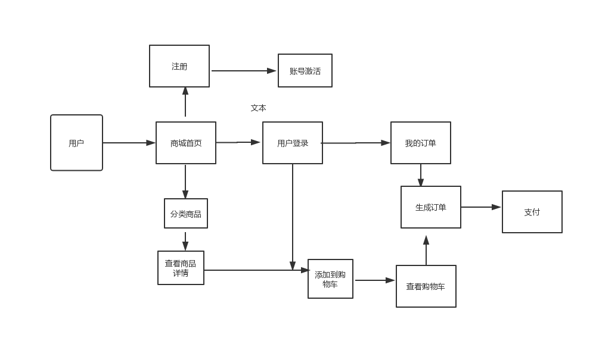

# GourdMall
### 葫芦商城     
系统功能描述 用户一共分为三种,普通用户（游客），会员（注册用户），管理员<br>
1. 普通用户可以访问商城首页 ，进行商品浏览 查找商品 也可以注册成为会员<br>
2. 会员用户 有普通用户的所有功能，还可以添加商品到购物车，并对购物车的商品<br>
进行操作 可以下订单 可以进如个人中心 修改自己的个人信息 可以对没有支付的订单<br>
进行支付或取消<br>
3.  管理员是平台的后台管理者 可以进行商品上下架，修改商品信息，查看所有订单情况<br>
 可以管理订单 <br>
4．下面是功能结构图：<br>



##  建数据库  

```sql
# 创建数据库
create database gourdmall
# 创建通用账户并授权
create user 'gourdmall'@'localhost' identified by '123456';
grant all privileges on gourdmall.* to 'gourdmall'@'localhost';
flush privileges;
```

用户表    
CREATE TABLE `user` (    
  `uid` varchar(32) NOT NULL COMMENT "用户编号",  
      
  `username` varchar(20) DEFAULT NULL COMMENT "用户名",  
     	  	
  `password` varchar(20) DEFAULT NULL COMMENT "密码",  
  	  
  `name` varchar(20) DEFAULT NULL COMMENT "昵称",	  
       		
  `email` varchar(30) DEFAULT NULL COMMENT "电子邮箱",     
     			
  `telephone` varchar(20) DEFAULT NULL COMMENT "电话",    		  
  `birthday` date DEFAULT NULL COMMENT "生日",    
  `sex` varchar(10) DEFAULT NULL COMMENT "性别",	     	  
  `state` int(11) DEFAULT 0 COMMENT "状态", #0=未激活，1=已激活  
  `code` varchar(64) DEFAULT NULL COMMENT "激活码",	    	
  PRIMARY KEY (`uid`)    
) ;   
INSERT INTO `user` VALUES      
('1','aaa','aaa','小华','617662163@qq.com','18379407495','2000-02-01','男',1,NULL),        
('2','ccc','ccc','aaa','bbb@store.com','15723689921','2015-11-04','男',0,'9782f3e837ff422b9aee8b6381ccf927bdd9d2ced10d48f4ba4b9f187edf7738'),     
('3','bb','bb','张三','bbb@store.com','15723689921','1990-02-01','男',0,'1258e96181a9457987928954825189000bae305094a042d6bd9d2d35674684e6'),     
('4','cc','cc','张三','bbb@store.com','15723689921','2015-11-03','男',0,'19f100aa81184c03951c4b840a725b6a98097aa1106a4a38ba1c29f1a496c231'),     
('5','bbb','bbb','老王','bbb@store.com','15712344823','2000-02-01','男',0,'71a3a933353347a4bcacff699e6baa9c950a02f6b84e4f6fb8404ca06febfd6f');     
   
   
--  创建分类表
CREATE TABLE `category` (  
  `cid` varchar(32) NOT NULL,   
  `cname` varchar(20) DEFAULT NULL comment "分类名称",	  
  PRIMARY KEY (`cid`)   
) ENGINE=InnoDB DEFAULT CHARSET=utf8;    
   
 INSERT INTO `category` VALUES   
 ('1','手机数码'),('2','电脑办公'),  
 ('3','家具家居'),('4','鞋靴箱包'),  
 ('5','图书音像'),('6','母婴孕婴'),  
 ('7','运动户外'),('8','汽车用品'); 
 
 创建商品表
 CREATE TABLE `product` (   
   `pid` varchar(32) NOT NULL,    
   `pname` varchar(50) DEFAULT NULL COMMENT "商品名称",   
   `market_price` double DEFAULT NULL COMMENT "市场价",	  
   `shop_price` double DEFAULT NULL COMMENT "商城价",   	 
   
   `pimage` varchar(200) DEFAULT NULL COMMENT "商品图片路径",	   
   
   `pdate` date DEFAULT NULL COMMENT "上架时间",   
   `is_hot` int(11) DEFAULT NULL COMMENT "是否热门" ,#0=不热门,1=热门    
   `pdesc` varchar(255) DEFAULT NULL COMMENT "商品描述",    
   `pflag` int(11) DEFAULT 0 COMMENT "商品标记 ",	#0=未下架(默认值),1=已经下架    
   `cid` varchar(32) DEFAULT NULL COMMENT "分类id",	 	   
   PRIMARY KEY (`pid`),    
   KEY `product_fk_0001` (`cid`),   
   CONSTRAINT `product_fk_0001` FOREIGN KEY (`cid`) REFERENCES `category` (`cid`)    
 ) ENGINE=InnoDB DEFAULT CHARSET=utf8;    
 
 创建订单表   
 CREATE TABLE `orders` (   
   `oid` varchar(32) NOT NULL,    
   `ordertime` datetime DEFAULT NULL comment "下单时间",	     
   `total` double DEFAULT NULL comment "总价",   
   `state` int(11) DEFAULT NULL comment "订单状态",  	      
   			#1=未付款;2=已付款,未发货;3=已发货,没收货;4=收货,订单结束   
   `address` varchar(30) DEFAULT NULL comment "收获地址",   
   `name` varchar(20) DEFAULT NULL comment "收货人",    
   `telephone` varchar(20) DEFAULT NULL comment "收货人带电话",    
   `uid` varchar(32) DEFAULT NULL ,    
   PRIMARY KEY (`oid`),    
   KEY `order_fk_0001` (`uid`),    
   CONSTRAINT `order_fk_0001` FOREIGN KEY (`uid`) REFERENCES `user` (`uid`)        
 ) ;    
 
 创建订单项表    
CREATE TABLE `orderitem` (    
  `itemid` varchar(32) NOT NULL,    
  `quantity` int(11) DEFAULT NULL comment "购买数量",   	  	  
  `total` double DEFAULT NULL comment "小计",   
  `pid` varchar(32) DEFAULT NULL comment "购买商品的ID",    
  `oid` varchar(32) DEFAULT NULL comment "订单项所在订单id",   
  PRIMARY KEY (`itemid`),    
  KEY `order_item_fk_0001` (`pid`),       
  KEY `order_item_fk_0002` (`oid`),      
  CONSTRAINT `order_item_fk_0001` FOREIGN KEY (`pid`) REFERENCES `product` (`pid`),      
  CONSTRAINT `order_item_fk_0002` FOREIGN KEY (`oid`) REFERENCES `orders` (`oid`)     
) ;     
